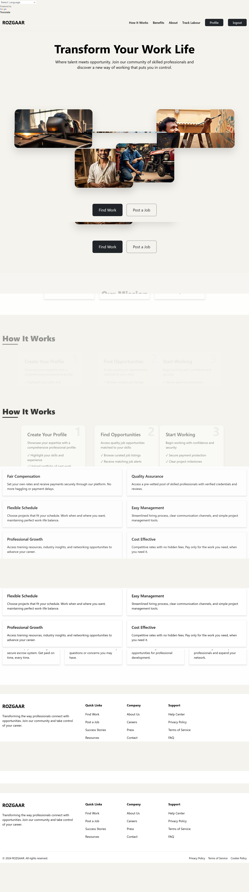
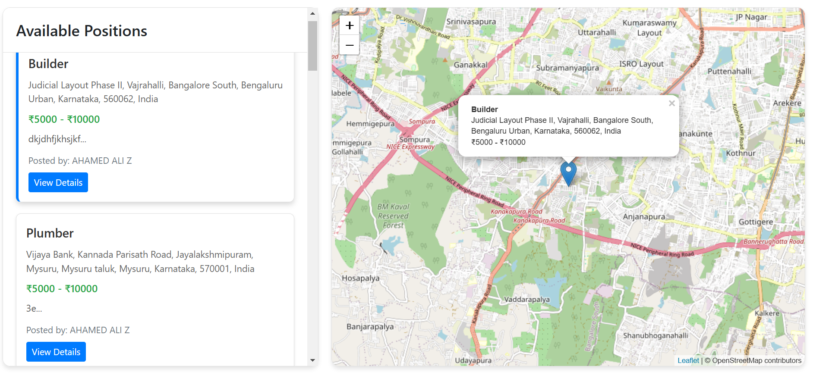

# Rozgaar - Empowering Rural Labor Through Digital Connection

## About
Rozgaar is a revolutionary platform designed to bridge the gap between skilled rural workers and employment opportunities. By leveraging modern technology while maintaining accessibility, Rozgaar creates meaningful connections between workers and employers.

### Home Page

### Location Based Search

## Key Features

### 🗺️ Location-Based Job Search
- Interactive map interface showing available jobs in the vicinity
- Real-time job listings with precise locations
- Distance-based filtering to find work opportunities nearby
- Easy-to-use visual interface suitable for users with limited technical literacy

### 📱 Accessibility Features
- Multilingual support with Google Translate integration
- Simple, intuitive user interface designed for rural users
- Works efficiently on low-bandwidth connections
- Mobile-responsive design for phone-based access

### 💼 Smart Job Matching
- Skill-based job recommendations
- Location-aware matching system
- Real-time notifications for nearby opportunities
- Customizable job preferences and search radius

### 🎥 Video Call Integration
- Built-in video call feature for remote interviews
- Low-bandwidth optimization for rural areas
- Screen sharing capabilities for skill demonstrations
- Recording options for future reference

### 👥 Worker Profiles
- Digital skill portfolios
- Verification system for credentials
- Rating and review system
- Work history tracking

### 💰 Payment Protection
- Secure payment gateway
- Escrow system for milestone-based payments
- Clear payment terms and conditions
- Multiple payment method support

## Technical Stack

### Frontend
- HTML5, CSS3, JavaScript
- Bootstrap 5 for responsive design
- GSAP for smooth animations
- Leaflet.js for interactive maps

### APIs & Integrations
- Google Translate API for language support
- OpenStreetMap for location services
- Video calling infrastructure
- Payment gateway integration

## Usage Guide

### For Workers
1. Create a profile with skills and location
2. Browse jobs on the interactive map
3. Apply for relevant positions
4. Schedule video interviews
5. Track applications and work history

### For Employers
1. Post job listings with location details
2. Review worker profiles and credentials
3. Conduct video interviews
4. Manage payments and milestones
5. Provide ratings and feedback

## Security Features
- End-to-end encryption for video calls
- Secure authentication system
- Data privacy compliance
- Regular security audits

## License
This project is licensed under the MIT License - see the [LICENSE](LICENSE) file for details.
